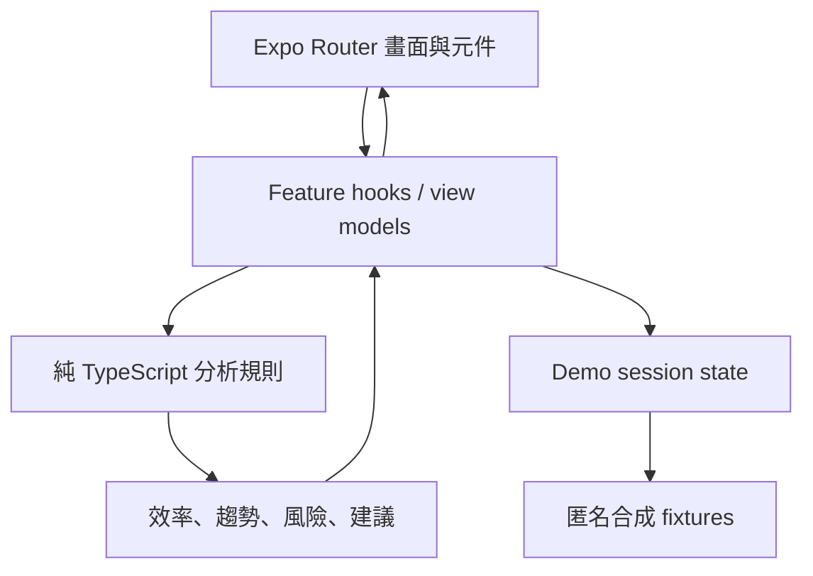

# 智學領航 LearnPilot AI｜系統架構與元件邊界

## 1. 架構決策摘要

本階段只建立一個可執行元件：

| 元件 | 路徑 | 責任 | 技術 | 狀態 |
|---|---|---|---|---|
| Mobile App | `app/` | UI、Demo fixture、裝置端規則分析與展示狀態 | React Native、Expo、Expo Router、TypeScript、pnpm | 可操作的離線競賽 Demo 已實作 |

明確不建立 `backend/`、`database/`、`web/`、`cms/`、`worker/`、`packages/`、Docker Compose 或 deployment resource。

理由：

- 使用者要求無後端、可運行的簡單 Demo。
- 競賽核心價值可用合成資料與裝置端規則完整展示。
- 真實雲端與 AI 會引入個資、成本、秘密、網路與可靠性風險。

## 2. 命名與 repository

- Project name：智學領航 LearnPilot AI
- Repository／本機根目錄：`LearnPilot_AI`
- Project slug：`learnpilot-ai`
- 保留的 Compose project name：`learnpilot_ai`（目前沒有 Compose）
- Git：只有 repository root 的 `.git/`
- Structure exception：無

`app/` 本身就是 Expo framework root，直接擁有 `package.json`、`pnpm-lock.yaml`、`app.json` 與 `src/app/`。不得建立 `app/LearnPilot_AI/` 或第二份 manifest。

## 3. 已確認 runtime 與 framework

本次初始化實際使用：

- Node.js `24.19.0`
- pnpm `11.16.0`（專案 pin；初始化曾使用 `11.19.0`）
- Expo SDK `57.0.12`
- React Native `0.86.2`
- React `19.2.3`
- TypeScript `6.0.3`
- Expo Router `57.0.12`
- ESLint `9.39.5` 與 `eslint-config-expo` `57.0.1`

以上版本來自實際 manifest 與 bootstrap 輸出，不代表未來永久鎖定。升級必須獨立處理、執行 Expo 相容性檢查並同步文件。

pnpm 11 的 dependency build policy 記錄於 `app/pnpm-workspace.yaml`，目前只允許 `unrs-resolver` 的必要 platform binding postinstall；不得改成全域允許所有 build scripts。

## 4. 執行時架構



所有 LearnPilot 產品流程都在 App process 內執行：

- 核心 Demo 流程無 network request
- 無登入或權限角色
- 無 production secret
- 無資料庫
- 無跨裝置同步
- App 重啟後可回到可重現的預設 Demo

Expo 官方 starter 與外部文件連結已移除。Web build 的瀏覽器驗收顯示主要 Demo 流程只有靜態本機資源請求，未發現外部請求。

## 5. 邏輯分層

### Route layer

責任：

- Expo Router route 與 navigation
- 畫面級 loading、empty、error state
- 將 route parameter 轉交 feature

限制：

- 不在 route component 內實作分析公式。
- 不直接讀寫 fixture 細節。

### Feature layer

建議功能邊界：

- `dashboard`
- `learning-log`
- `analytics`
- `risk`
- `study-plan`
- `growth-history`
- `demo-control`

責任：

- 組合畫面所需的 view model
- 處理使用者行動與 session state
- 呼叫 domain selector／rule

### Domain layer

責任：

- 效率分數
- 黃金時段
- 科目趨勢
- 風險分數與因素
- 建議產生

規則：

- 使用無副作用的純 TypeScript 函式。
- 輸入與輸出型別明確。
- 時間、門檻與權重集中管理。
- 不依賴 React、route、圖表或裝置 API。
- 每個結論輸出原因、證據、信心水準／資料充足度與 disclaimer。

### Data layer

本階段只包含：

- versioned synthetic fixtures
- in-memory session repository
- reset-to-default action

不加入 AsyncStorage，除非 Demo 確定需要跨重啟保留使用者輸入。若加入，必須同步資料保留、清除與測試規則。

### Presentation primitives

共用元件只在至少兩個功能使用時抽出。優先使用 React Native／Expo 既有 primitive，不在一開始引入大型 UI kit。

本輪以 React Native 原生 `View` 組成輕量柱狀圖與趨勢文字摘要，沒有新增圖表套件；這讓離線 Web fallback 與可解釋文字維持單純。

## 6. 實際 route map

下列路由均已建立：

```text
src/app/
├── _layout.tsx
├── (tabs)/
│   ├── _layout.tsx
│   ├── index.tsx          # 今日
│   ├── analytics.tsx      # 分析
│   ├── plan.tsx           # 計畫
│   └── history.tsx        # 歷程
├── record/
│   └── new.tsx            # 新增 Demo 紀錄
├── risk/
│   └── [subjectId].tsx    # 科目風險詳情
├── insight/
│   └── [insightId].tsx    # 建議與證據
└── about-demo.tsx         # 合成資料與 AI 揭露
```

`src/app/index.tsx` 會導向主要 tabs；所有主要與次要路由均由 Expo Router static export 掃描成功。

## 7. 實際 source structure

已依下列結構放置 route、純規則、fixture、session state 與共用呈現元件：

```text
app/src/
├── app/                   # routes
├── features/              # feature-specific UI / hooks / view models
├── domain/                # pure analysis rules and types
├── data/                  # fixture repository and session adapter
├── fixtures/              # explicitly synthetic demo data
├── components/            # shared presentation components
├── constants/             # theme and rule configuration
└── utils/                 # small framework-independent utilities
```

若某程式碼只有一個 feature 使用，先留在該 feature，不建立抽象層或 `packages/`。

## 8. 核心 domain objects

### `StudentProfile`

- `id`
- `displayName`
- `gradeBand`
- `subjects`
- `dataDisclosure`

Demo 固定為匿名合成 profile。

### `StudySession`

- `id`
- `startedAt`
- `endedAt`
- `subjectId`
- `topic`
- `focusScore`（0–100）
- `questionsAttempted`
- `questionsCorrect`
- `completionScore`（0–100）
- `source`（固定為 `synthetic` 或 `demo-input`）

### `Assessment`

- `id`
- `subjectId`
- `takenAt`
- `score`
- `maxScore`
- `source`

### `StudyPlanItem`

- `id`
- `subjectId`
- `topic`
- `scheduledAt`
- `durationMinutes`
- `status`
- `reasonInsightId`

### `Insight`

- `id`
- `kind`
- `severity`
- `title`
- `reason`
- `evidence`
- `action`
- `disclaimer`

### `RiskAssessment`

- `subjectId`
- `score`（0–100）
- `level`
- `factors`
- `sampleSize`
- `evaluatedAt`
- `ruleVersion`

## 9. 資料流

### 啟動

1. 載入 versioned fixture。
2. 建立 in-memory session state。
3. domain selectors 計算 dashboard snapshot。
4. UI 顯示「合成 Demo 資料」揭露。

### 新增 Demo 紀錄

1. 驗證表單欄位與範圍。
2. 建立 `demo-input` session record。
3. 更新記憶體 repository。
4. 重新計算分析與建議。
5. UI 顯示變化來源。

### 重設

1. 清除 session mutation。
2. 重新載入 fixture version。
3. 回到 Demo 起始 route。

## 10. State management 決策

初期使用 React Context + `useReducer`：

- 無需新增依賴。
- Demo state 小且生命週期單純。
- action 可明確支援新增紀錄、接受／略過建議與重設。

若實作後出現明顯效能或維護問題，再以實際證據評估其他 state library，不預先安裝。

Server state library 不適用，因本階段沒有 server。

## 11. 錯誤與邊界處理

- fixture 解析失敗：顯示可恢復錯誤與重設操作。
- 樣本不足：顯示「資料不足」，不產生強結論。
- 數值超出範圍：表單阻擋並由 domain guard 拒絕。
- 分析函式例外：捕捉於 feature boundary，保留其他分頁可操作。
- 圖表無法顯示：保留文字摘要與原始值。
- 不記錄真實學生資料到 log。

## 12. 測試邊界

### 必要自動化

- Domain unit tests：正常、缺值、樣本不足、極端值、相同輸入可重現。
- Reducer tests：新增、接受、略過、重設。
- Component tests：空狀態、風險狀態、錯誤狀態、accessibility label。

### 必要人工驗收

- iOS／Android 中至少一個原生載體。
- Web fallback。
- 小尺寸手機文字與觸控區。
- 無網路啟動。
- 完整 Demo 重設與重跑。

目前使用 Vitest 執行 domain 單元測試（8 項通過）。Reducer、component 與原生 iOS／Android 驗收仍是後續強化範圍。

## 13. 信任與安全邊界

目前 App 是不可信任的公開 client：

- 任何放入 bundle 的值都視為公開資訊。
- 不放 API key、model key、學生個資或學校資料。
- UI 顯示不等於授權控制；真實產品若有帳號與敏感資料，必須新增可信任 backend。
- 所有「AI」輸出是本機規則模擬，不得假裝來自未存在的模型。

## 14. 未來架構升級關卡

下列任一需求出現時，必須先更新 Profile、架構、資料、隱私與整合文件並取得明確核准：

- 真實登入、教師／家長角色
- 真實學生紀錄或未成年人資料
- 跨裝置同步或學習平台 API
- LLM／ML model、外部 AI service
- push notification、背景工作
- backend、database、file storage
- production deployment 或公開測試

若未來新增 backend，App 只能透過已文件化的 public API URL 存取；不得在 production 依賴本機 service name。部署拓撲需另行設計，本文件不預設 Coolify 或 Compose。

## 15. 依賴與授權政策

- 優先使用 Expo SDK 內建或官方維護套件。
- 新依賴前確認用途、Expo SDK 57 相容性、授權、維護狀態與替代方案。
- 不因範本或方便加入 analytics、auth、AI、cloud SDK。
- 專案 LICENSE 尚未決定；官方 template 自動產生的 LICENSE 已從專案移除，避免錯誤宣告授權。
